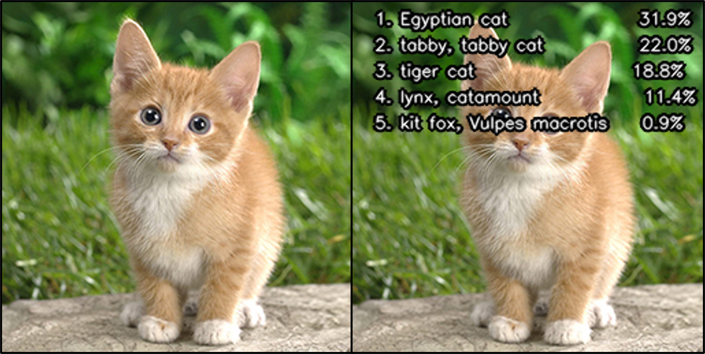

# Image Classification Demo (using Huggingface Models)

This demo shows how to use an Image Classification model from Huggingface with MERA software stack. The demo comprises installation of the required library followed by compilation of the model and running inference with MERA software stack.

## Setup

* `mera-models` python library is required.

## Model export and compilation 
 
The model can be compiled either by exporting it directly from Huggingface or by using the pre-exported model.

### Export model from Huggingface and compile

* To export the model directly from Huggingface and deploy it, use the below mentioned code.
* This will also save the ONNX model in `./source_model_files/`
* This will deploy the model for the default target `InterpreterHwBf16`. 
* Other target can be specified using _--target_ argument, for example to deploy for the target `Interpreter`, add following to the below mentioned code: `--target interpreter`
* use `--target ip` to get deployment for actual hardware

``` bash
python deploy.py --model_id "microsoft/resnet-50" --target ip
```

### Deploy using pre-exported ONNX model

* If the ONNX model has already been exported, it can be used for the deployment:

``` bash
python deploy.py --model_id "source_model_files/microsoft__resnet-50_onnx"
```

## Quantization and Deploy

* using mera quantizer to quantize the source file before going into deploy

``` bash
python quantize_model.py --model_id "source_model_files/microsoft__resnet-50_onnx" --qtzed_path "./qtzed_tmp"
```

* then use the output as a source for deploy. Target should be `interpreterhw`, `simulator`, or `ip`

``` bash
python deploy.py --model_id "./qtzed_tmp" --target ip --out_dir "./deploy_resnet50"
```

## Inference

Inferencing can be done using the compiled model as well as the ONNX model exported from Huggingface.

### Inference using compiled model

* To run inference using the compiled model, use the below mentioned code.
* Other target can be specified using _--target_ argument, for example to run inference for the target `Interpreter`, add following to the below mentioned code: `--target interpreter`

``` bash
python demo_model.py --model_path ./deploy_vit-base-patch16-224 --target ip
```
### Inference using exported ONNX model

* To run inference using the exported ONNX model, use the below mentioned code.

``` bash
python demo_model.py --model_path "source_model_files/google__vit-base-patch16-224_onnx"
```

## Sample result


