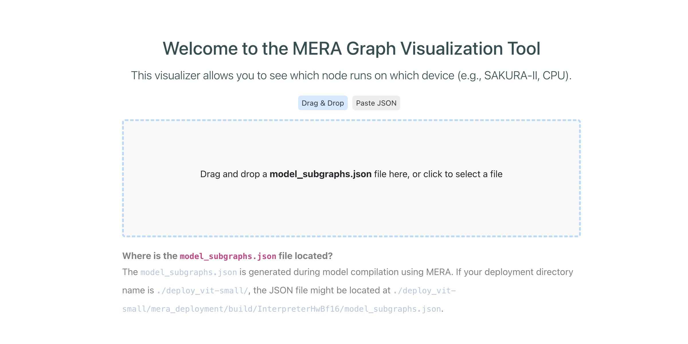
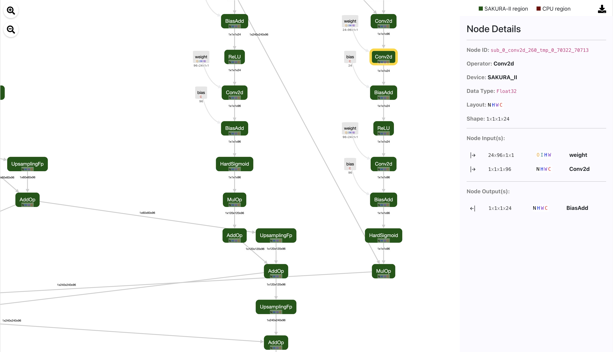

# MERA-Visualizer Guide


This article will demonstrate how to inspect a MERA model using `mera-visualizer`. It is a web interface tool that helps visualize which nodes run on which devices (e.g., SAKURA-II, CPU).

## Installation

By default, it is installed when you install the mera developer package with installation scripts. Alternatively, you can install it as a standalone tool (without other mera dependencies) in a separate virtual environment using the package wheel.

```
pip install mera_visualizer-*.whl
```

The actual wheel file name may vary depending on the version. For example, for version 2.2.0, the file name could be `mera_visualizer-2.2.0-py3-none-any.whl`.


## Running

To run mera-visualizer on your local machine, open a **new terminal**, activate the virtual environment where `mera-visualizer` is installed, and then run the following command:

```
mera-visualizer --port=5566
```

This will start a server in localhost.
```
 * Running on http://127.0.0.1:5566
```

Open your web browser and enter [`http://localhost:5566/`](http://localhost:5566/) or [`http://127.0.0.1:5566`](http://127.0.0.1:5566) address. 
Please change the `--port` number if you want to run the visualizer on a different port. 


However, if you want to run `mera-visualizer` on another machine (e.g., a server in the same local network) and access it from your local machine via a web browser, run the following command:

```
mera-visualizer --port=5566 --host="0.0.0.0"
```

You can access `http://<your_server_address>:5566/`

> **IMPORTANT**: Exposing `--host` to the public (`0.0.0.0`) is not recommended due to security risks. We recommend running `mera-visualizer` on your local machine (`localhost`). Additionally, please note that the `mera-visualizer` tool is intended for debugging purposes and is designed specifically for developers. The default Flask web server used by this visualizer is not configured for using in public networks.
<br>

## Using the Visualizer:

In the web browser, you will see a dropdown box to upload the `model_subgraphs.json` file. You can also paste the contents of the JSON file using 'Paste JSON.'



The `model_subgraphs.json` file is generated by the MERA compiler. It contains the edge list of the model graph, which the MERA Visualizer parses and renders as an SVG visualization.

### Where to find the `model_subgraphs.json`?
After compilation, the `model_subgraphs.json` file will be generated inside the deployment directory.
For example, if the deployment directory is `deploy_detr/`, the directory structure might look as follows:

```
├── deploy.py 
├── deploy_detr/
│   ├── build/
│   │   └── InterpreterHwBf16/
│   │       ├── model_subgraphs.json   # <-- THIS FILE
│   │       ├── compilation/
│   │       ├...
│   ├── model/
├── demo_model.py
...
```

Depending on the compaction target, the `model_subgraphs.json` file may be located in slightly different locations
* `deploy_detr/build/InterpreterHwBf16/model_subgraphs.json`
* `deploy_detr/build/IP/model_subgraphs.json`

If you quantize the model using the MERA quantizer, the `model_subgraphs.json` file is not visible by default.
In such cases, please specify quantization path in `mera.Deployer()` context.

```python

with mera.Deployer(qtzed_path / "qtzer_deploy", overwrite=True) as deployer:
        model_fp32 = mera.ModelLoader(deployer).from_onnx(model_fp32)
        
        qtzer_cfg = mera.quantizer.QuantizerConfigPresets.DNA_SAKURA_II
        qtzer = mera.Quantizer(
            deployer,
        ...
```
For example, in above code if `qtzed_path=quantized_dir`, a `{model_name}_ir.json` file will be created inside `./quantized_dir/qtzer_deploy/build/MERAInterpreter/ir_dumps` dir. This is the model graph for mera-visualizer. 
<br>


### UI Features:
* Use **Zoom In** or **Zoom Out** to adjust the scale of the graph.
* Double-click anywhere on the canvas to reset the graph to its **default view**.
* Click and drag on the UI canvas to **pan** across the graph.
* Click on a node to view the **node details**.
* Click and drag on a node to move the node.



